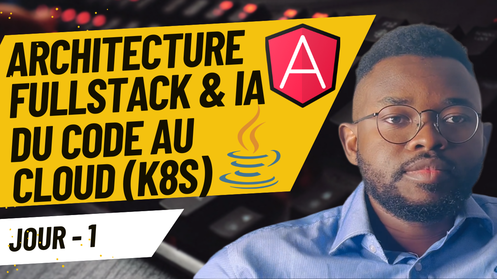
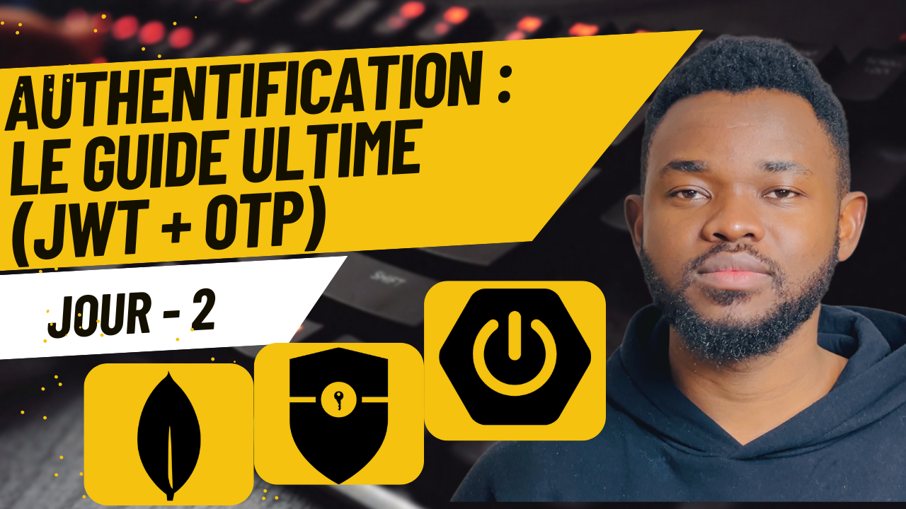
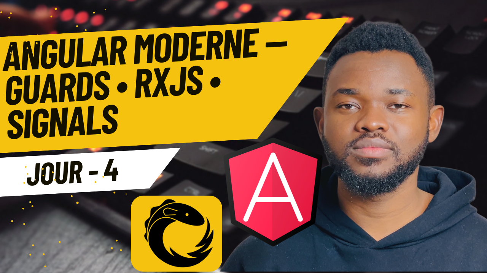
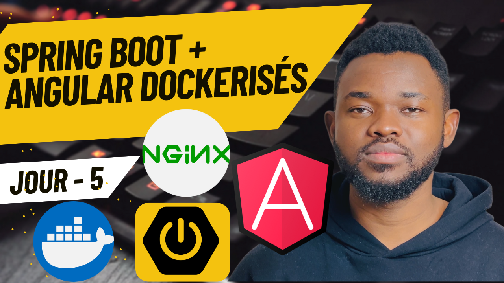
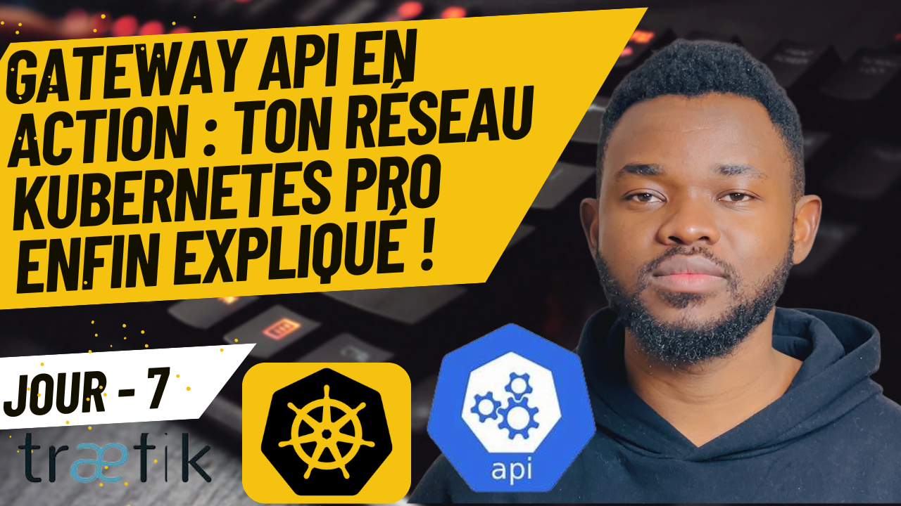

    <h1 align="center">🎓 FinEd Mentor 🎓</h1>
    <h3 align="center">AI-Powered Financial Education Platform</h3>

    
    
    
    

## Table of Contents

- [Table of Contents](#table-of-contents)
- [Course Overview](#course-overview)
- [Who is this project for?](#who-is-this-project-for)
- [What you'll learn](#what-youll-learn)
- [Getting started](#getting-started)
- [Course syllabus](#course-syllabus)
- [The tech stack](#the-tech-stack)
- [Contributors](#contributors)
- [License](#license)

## Course Overview

**FinEd Mentor** is an intelligent learning platform that combines modern web technologies with Generative AI to provide personalized education in Finance, Real Estate, and Investment.

By the end of this project, you'll have built a complete Fullstack application capable of:

*   Engaging in realistic conversations about finance using **Google GenAI** 🧠
*   Generating personalized quizzes on the fly 📝
*   Managing secure user authentication with **JWT** 🔐
*   Deploying to a production-grade **Kubernetes** cluster ☁️

> You can think of it as your personal AI financial advisor, available 24/7.

---

## Who is this project for?

This project is for Software Engineers, Fullstack Developers, and DevOps enthusiasts who want to master the art of building scalable, AI-integrated applications. It covers everything from code to cloud.

## What you'll learn

*   Build a robust Backend with **Spring Boot 3**
*   Create a dynamic Frontend with **Angular 18** and **Signals**
*   Integrate **Google Gemini** for AI chat and content generation
*   Secure your API with **Spring Security** and **JWT**
*   Containerize applications with **Docker**
*   Orchestrate microservices with **Kubernetes**
*   Implement a GitOps pipeline with **Jenkins** and **Argo CD**

<table style="border-collapse: collapse; border: none;">
  <tr style="border: none;">
    <td width="20%" style="border: none;">
      
    </td>
    <td width="80%" style="border: none;">
      

        <h2>📬 Stay Updated</h2>
        
<b><a href="https://maxwelltbtech.substack.com/">Join  Maxwell TB Tech</a></b> and Build the future: Full-stack development in the age of AI, directly to your inbox. Don't miss out!

      

    </td>
  </tr>
</table>

  

## Getting started

To get started with FinEd Mentor locally:

1.  **Clone the repository**
2.  **Backend**: Navigate to `backend/` and run `mvn spring-boot:run`
3.  **Frontend**: Navigate to `frontend/` and run `npm start`
4.  **Infrastructure**: Check the `k8s/` directory for deployment manifests.

## Course syllabus

| Lesson Number | Written Lesson | Video Lesson | Description |
|---------------|----------------|--------------|-------------|
| 
1
 | [Project overview](https://maxwelltbtech.substack.com/p/system-design-and-architecture-fined) |  | Understand the project architecture, the problem it solves, and the high-level design. |
| 
2
 | [securisez-votre-api-tuto-complet](https://maxwelltbtech.substack.com/p/securisez-votre-api-tuto-complet) |  | Implement secure authentication using **JWT** and email validation with **OTP**. |
| 
3
 | [Comprendre l'Architecture en Couches Spring Boot ](https://maxwelltbtech.substack.com/p/comprendre-larchitecture-en-couches)|   | Integrate **Google GenAI** to power the chat interface and generate dynamic quizzes. |
| 
4
 | [Deep dive frontend Angular ](https://maxwelltbtech.substack.com/p/deep-dive-frontend-angular)|  | Master **Angular Signals** for reactive and efficient state management in the frontend. |
| 
5
 | [Dockeriser proprement une appli full‑stack — principes et recette pratique](https://open.substack.com/pub/maxwelltbtech/p/dockeriser-proprement-une-appli-fullstack?r=69je8w&utm_campaign=post&utm_medium=web&showWelcomeOnShare=true)|  | Dockerfile multi‑stage + Nginx — Dockeriser Backend & Frontend |
| 
6
 | [Maîtrisez l'Orchestre : Tuto Complet Kubernetes, Minikube & Déploiement Local](https://maxwelltbtech.substack.com/p/maitrisez-lorchestre-tuto-complet)|  | Deploy the full stack to a **Kubernetes** cluster with deploy, Services, and Pods. |
| 
7
 |  [L’API Gateway Kubernetes : la régie scénique de ton orchestre applicatif](https://maxwelltbtech.substack.com/p/lapi-gateway-kubernetes-la-regie)|  | Guide Pratique : Mettre en Scène une Gateway avec Traefik |
| 
8
 | coming soon..| coming soon.. | Automate the pipeline: **Jenkins** for CI (Build/Test) and **Argo CD** for CD (GitOps).  |

## The tech stack

<table>
  <tr>
    <th>Technology</th>
    <th>Description</th>
  </tr>
  <tr>
    <td></td>
    <td>**Spring Boot 3.5**: The backbone of our backend, providing a robust and scalable REST API.</td>
  </tr>
  <tr>
    <td></td>
    <td>**Angular 18**: A modern frontend framework using Signals for reactive UI components.</td>
  </tr>
  <tr>
    <td></td>
    <td>**MongoDB**: Flexible NoSQL database for storing users, chats, and quizzes.</td>
  </tr>
  <tr>
    <td></td>
    <td>**Docker**: Containerization for consistent environments across dev and prod.</td>
  </tr>
  <tr>
    <td></td>
    <td>**Kubernetes**: Orchestration platform for managing our microservices at scale.</td>
  </tr>
  <tr>
    <td></td>
    <td>**Jenkins**: Automation server for building and testing our code (CI).</td>
  </tr>
  <tr>
    <td></td>
    <td>**Argo CD**: GitOps continuous delivery tool for Kubernetes.</td>
  </tr>
</table>

## Contributors

<table>
  <tr>
    <td align="center"></td>
    <td>
      <strong>Loic Maxwell Tchiabe | Passionierter Full Stack Developer | Spezialist für Angular, Java & Python </strong> 
      <i>Cloud & AI Systems Enthusiast.</i>  
      <a href="https://www.linkedin.com/in/loic-maxwell-tchiabe-softwareentwickler-cloud-ai-java-python-angular/">LinkedIn</a> 
      <a href="www.youtube.com/@MaxwellTBTech">Youtube</a> 
      <a href="https://maxwelltbtech.substack.com/">Maxwell TB Tech Newsletter</a> 
    </td>
  </tr>
</table>

## License

This project is licensed under the MIT License - see the [LICENSE](LICENSE) file for details.
